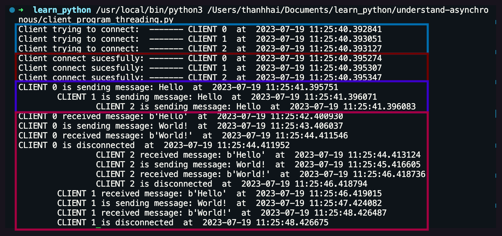
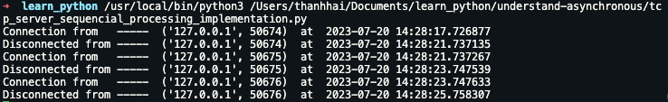
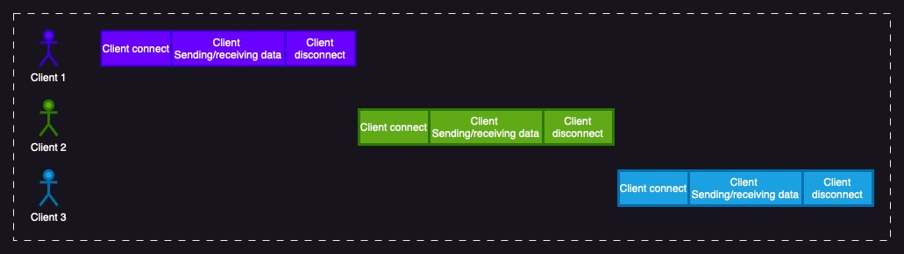
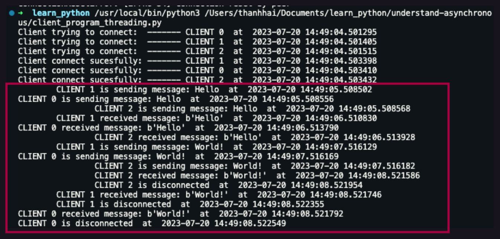
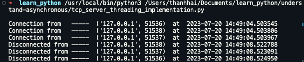
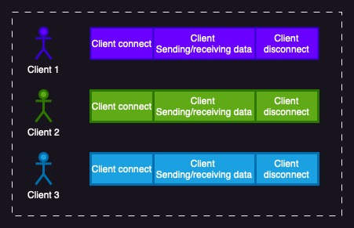
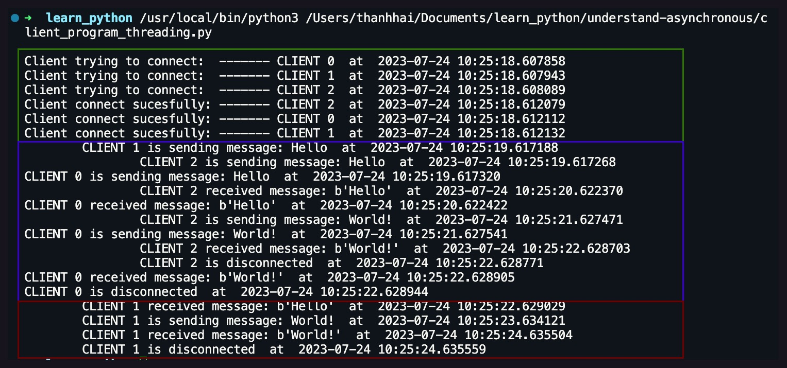

# Understand Asynchronous Programming

I wanted to take a moment to say thank you to [@nguyenanhhao998](https://github.com/nguyenanhhao998), [@chunguyenduc](https://github.com/chunguyenduc), [@hieuwu](https://github.com/hieuwu) and vot zo for the great coffee talks that inspired me to write this article. I'm grateful for your support in my learning journey

## Introduction
Traditionally, your programs run sequentially, which means using a linear order and execution of operations where each operation must complete before the next operation can begin. It can also be called synchronous programming.

You can find this type of programming everywhere, from simple projects to more complex systems, because it's easier to write and understand, intuitive to debug, and predictable to run. However, this style of programming can lead to long execution times and limit the scalability of your code, especially when dealing with long running tasks or heavy processing.

Asynchronous execution, on the other hand, is a mode of code execution that allows multiple lines of code to execute at the same time. This means that if one line of code takes a long time to execute, other lines of code can continue to execute at the same time. Asynchronous code is more complex than synchronous code, but it can be much more efficient for certain types of programs. So, how can we do Asynchronous programming?

## Synchronous programming
Before we start diving in Asynchronous programing, let take a look on how our computer do in a synchronous manner. this article will try to implement a TCP server in __python 3.11__ that manages a single client sequentially is a relatively simple task. The server actively monitors a specific port for incoming connections, and upon receiving a connection request from a client, engages in communication with that client until the connection is terminated. Afterwards, the server resumes its role of listening for new connection requests. This straight forward process can be achieved by employing fundamental socket programming techniques.

```python
import socket
from datetime import datetime


HOST = '127.0.0.1'
PORT = 12345


def handle_client(socket_conn):
    while True:
        received_data = socket_conn.recv(4096)
        if not received_data:
            break
        socket_conn.sendall(received_data)

    print('Disconnected from ----- ', socket.getpeername(), ' at ', datetime.now())
    socket_conn.close()


def run_server(host, port):
    socket_conn = socket.socket()
    socket_conn.setsockopt(socket.SOL_SOCKET, socket.SO_REUSEADDR, 1)
    socket_conn.bind((host, port))
    socket_conn.listen()
    while True:
        client_socket, addr = socket_conn.accept()
        print('Connection from   ----- ', addr, ' at ', datetime.now())
        handle_client(client_socket)


if __name__ == '__main__':
    run_server(HOST, PORT)
```

What we do here in nutshell is:

1. Create a new TCP/IP socket using the `socket.socket()` function.
2. Bind the socket with a specific address and port using `socket_conn.bind()`.
3. Set the socket to a "listening" state using `socket_conn.listen()`.
4. Accept incoming connections using `socket_conn.accept()`.
5. Receive data from the client using `sock.recv()` and send the data back to the client using `sock.sendall()`.

the code will create a basic TCP Echo server in my local machine. By design, this echo server will behave in a synchronous manner. When multiple clients attempt to connect to the server simultaneously, one client establishes a connection and occupies the server, while the remaining clients are compelled to wait until the active client disconnects.

I have created a program to simulate when 3 client connect to this server at the same time:

```python
# Client connecting at the same time

import socket
import threading
import time
from datetime import datetime


HOST = 'localhost'
PORT = 12345


def client_socket(client_number):
    messages = ["Hello", "World!"]

    print("Client trying to connect:  -------" + f" CLIENT {client_number}", ' at ', datetime.now())
    client_socket = socket.socket(socket.AF_INET, socket.SOCK_STREAM)
    client_socket.connect((HOST, PORT))
    print("Client connect sucesfully: -------" + f" CLIENT {client_number}", ' at ', datetime.now())

    for message in messages:
        time.sleep(1)
        print("\t"* client_number + f"CLIENT {client_number} is sending message: {message}", ' at ', datetime.now())
        client_socket.sendall(message.encode())

        time.sleep(1)
        data = client_socket.recv(1024)
        print("\t"* client_number + f"CLIENT {client_number} received message: {data}", ' at ', datetime.now())

    client_socket.close()
    print("\t"* client_number + f"CLIENT {client_number} is disconnected", ' at ', datetime.now())

num_clients = 3


for client in range(0, num_clients):
    threading.Thread(target=client_socket, args=(client,)).start()
```

When we run this client program, we can take a look at the behaviour of the application.



<span style='color: #006EAF;'> Client trying to connect:</span> three client will trying to connect to the server at the same time

<span style='color: #6F0000;'> Client connect sucesfully:</span> the clients can reach to the server

<span style='color: #3700CC;'> Client is sending message:</span> the 3 client will try sending message to the server

<span style='color: #a50040;'> How the server handling the client:</span> the server can only handle one client at the time, it have to wait until the current client to disconnect and then the new client can connect to the server. we can take a look at the server's log:



The diagram bellow indicates how the TCP echo server is working:



> **Conclusion**: This is inefficent and the other client have to wait until they can access. If there is a slow client, this could make the service unavailable to everyone.

## How python do thing asynchronously?

### Operating System's Threads

A **thread** represents **a sequential execution flow of tasks within a process**, which is also referred to as a thread of execution. Each operating system provides a mechanism for executing threads within a process and a process can contain multiple threads. So, how can we use thread to execute tasks concurrently?

#### Multi-Thread Executions

First we need to adjust the scripts to make the `handle_client()` function to run in multiple thread. Instead of calling the function in the main thread, we use threading library in python and change how we call the `handle_client()` into  `thread = threading.Thread(target=handle_client, args=[client_sock])` and then start the process by `thread.start()`.

```python
def run_server(host, port):
    socket_conn = socket.socket()
    socket_conn.setsockopt(socket.SOL_SOCKET, socket.SO_REUSEADDR, 1)
    socket_conn.bind((host, port))
    socket_conn.listen()

    while True:
        client_socket, addr = socket_conn.accept()
        print('Connection from   ----- ', addr, ' at ', datetime.now())
        thread = threading.Thread(target=handle_client, args=[client_socket])
        thread.start()

```
You can get full code in the file tcp_server_threading_implementation.py

When we can start to run the new TCP echo server and re run the client program and then this is the result:




On the server side, we can see that the clients dont have to wait any more:


So we can see all the clients are being handled simultaneously. This is how the threading client tackle the concurrency, the process can be visualized through this diagram:



However, this approach have some problems. Thread is a kind of expensive resource interms of memory, an os have limited number of threads. So, the one-client-per-thread doesn't scale well and we will soon run out of thread. This can resulted in the server will not only work poorly under heavy workload, but also becomes an easy target for DoS attack. Is there anyway we can improve this?


#### Thread Pool Executions

Thread pools offer a solution to the issue of uncontrolled thread creation. Instead of creating a new thread for each task, we employ a queue to which we submit tasks, and a group of threads, forming a thread pool, takes and processes these tasks from the queue. This approach allows us to set a predetermined maximum number of threads in the pool, preventing the server from spawning an excessive number of threads. Below is an example of how we can implement a thread pool version of the server using the Python standard concurrent.futures module:

```python
pool = ThreadPoolExecutor(max_workers=2)

def run_server(host, port):
    socket_conn = socket.socket()
    socket_conn.setsockopt(socket.SOL_SOCKET, socket.SO_REUSEADDR, 1)
    socket_conn.bind((host, port))
    socket_conn.listen()
    while True:
        client_socket, addr = socket_conn.accept()
        print('Connection from   ----- ', addr, ' at ', datetime.now())
        pool.submit(handle_client, client_socket)
```
How is this different from the threading way? Well, you can see the thread pool executor is now set as 2, this mean there are only 2 client handled at the same time. we can try by running the thread pool server and 3 client trying to connect. One client will have to wait out side the pool just like the sequencial server, when the 2 in the pool is disconnect, the last client will join the party:



<span style='color: #2D7600;'> Client trying to connect:</span> three client will trying to connect to the server at the same time

<span style='color: #3700CC;'> Handle clients in the pool:</span> the fist 2 client will seize the pool until they disconnect.

<span style='color: #6F0000;'> Handle clients out side the pool:</span> when the clients in the pool disconnect, the clients who wait out side will be able to jump in (similar to those who connect in the sequencial server).

> **Conclusion**:  Using a thread pool is a practical and uncomplicated method. However, it is essential to tackle the problem of slow clients monopolizing the thread pool. This can be handled in several ways, including **terminating long-living connections**, **setting a minimum throughput rate for clients**, **enabling task prioritization**. Archieving efficient concurrent server performance with OS threads is more intricate than it seems at first, urging us to explore alternative concurrency strategies.

#### IO-Multiplexing


