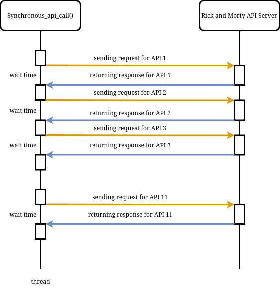

# Apply asynchronous programming to speed up your Python code

I wanted to take a moment to say thank you to [@nguyenanhhao998](https://github.com/nguyenanhhao998), [@chunguyenduc](https://github.com/chunguyenduc), [@hieuwu](https://github.com/hieuwu) and vot zo for the great coffee talks that inspired me to write this article. I'm grateful for your support in my learning journey

## Introduction
Traditionally, your programs run sequentially, which means using a linear order and execution of operations where each operation must complete before the next operation can begin, it can also be called synchronous programming. You can find this type of programming everywhere, from simple projects to more complex systems, because it's easier to write and understand, intuitive to debug, and predictable to run. 

However, this style of programming can lead to long execution times and limit the scalability of your code, especially when dealing with long running tasks that depend on an external source or heavy processing using your CPU. These problem are generally called **I/O bound** and **CPU bound**. So, how can we apply asynchronous programming to speed up our application?

#### The key is concurrency and parallelism

the 2 concepts concurrency and parallelism are both used to managing and executing mutiple tasks, but the way they execute is different. Let's take a look at the diagram bellow to see how the 2 paradigm different from each other and compare to synchronous way:
<p align="center">
  
</p>

**Concurrency** doesn't necessary mean that multiple tasks must run at the same time, they can run for some time, then paused then let other tasks run and maybe it can get to run in the future. **Parllelism** on the other hands, do tasks simultaneously. Each tasks will  have its own swimlane, allowing tasks to run at the same time with others.

Moving on the the next part, we will break down how concurrency can handle both I/O bound and CPU bound then which paradigm to chose in each case.

## I/O bound
In computer science, I/O bound refers to a condition in which the time it takes to complete a computation is determined principally by the period spent waiting for input/output operations to be completed. This circumstance arises when the rate at which data is requested is slower than the rate it is consumed or, in other words, more time is spent requesting data than processing it. 

For example, when we are calling an API, we need to wait for the server to send us a response or when the application need to search for a file in your hard drive, ... All of this cause a delay in your code as the program will have to wait for the resource and continue to process.

Let's take a look at the example bellow, where we are trying to call for 10 character apis from rickandmortyapi.com and let the response delay for 2 seconds to mimic the deplay of the server:

```python
import requests
import time
import logging
import sys

date_strftime_format = "%Y-%m-%d %H:%M:%S"
message_format = "%(asctime)s.%(msecs)05d - %(levelname)s - %(message)s"

logging.basicConfig(
        level = logging.INFO,
        format = message_format, datefmt = date_strftime_format,
        handlers = [
            logging.StreamHandler(sys.stdout)
        ]
    )
logger = logging.getLogger('log output')

DELAY_FACTOR = 2

# Get response from API using 
def get_character_data(character_index: int):
    logger.info(f'Ingesting character number {character_index}')
    response = requests.get(f'https://rickandmortyapi.com/api/character/{character_index}')
    
    if response.status_code == 200:
        logger.info(f"Ingested successfully character number {character_index}")
    else:
        logger.error(f"Ingestion failed character number {character_index}!")

    time.sleep(DELAY_FACTOR)
    return response

# Synchronous programming
def synchronous_api_call(number_of_apis: int):
    for i in range(1, number_of_apis + 1):
        response = get_character_data(i)

if __name__ == "__main__":
    start_time = time.time()

    synchronous_api_call(10)
    total_execution_time = time.time() - start_time 
    print(total_execution_time)
```

And we can check out the log for understanding the execution of the synchonous code:

<p align="center">
  
</p>

We can describe this through a diagram:

<p align="center">
  
</p>

we can see the idle time between every time the application sending the requests and receive the response from the API. this casause unnecessary wait time and this we usually call **I/O bound**.

### How to tackle I/O bound with concurrency?

#### Operating System's Threads

A **thread** represents **a sequential execution flow of tasks within a process**, which is also referred to as a thread of execution. Each operating system provides a mechanism for executing threads within a process and a process can contain multiple threads. So, how can we use thread to execute tasks concurrently?

##### Multi-Threading Executions
Reusing the code block above, we can add a minor change in the code to change the process into multi-threading execution

```python
import threading

# OS threads
def threading_api_call(number_of_apis: int):
    # Create and start multiple threads
    threads = []
    for i in range(1, number_of_apis + 1):
        thread = threading.Thread(target=get_character_data, args=(i,))
        threads.append(thread)
        thread.start()

    # Wait for all threads to finish
    for thread in threads:
        thread.join()
```

we can see the significant change in the execution times:
<p align="center">
  
</p>

the diagram bellow indicates how the code actually run with this type of concurrent programming:

<p align="center">
  
</p>

Right now we can see the usage of OS's thread, when we are processing and run into an IO operation, the thread will switch to another one until the IO operation occurs again. this process keep happen until we handle the whole program. the <span style='color: #9673A6;'>purple arrow </span> indicates the **context switching** in multi-threading execution.

However, this approach have some problems. Thread is a kind of expensive resource interms of memory, an os have limited number of threads. So, the one-api-call-per-thread doesn't scale well and we will soon run out of thread. This can resulted in the server will not only work poorly under heavy workload, is there anyway we can improve this?

##### Thread Pool Executions

Thread pools offer a solution to the issue of uncontrolled thread creation. Instead of creating a new thread for each task, we employ a queue to which we submit tasks, and a group of threads, forming a thread pool, takes and processes these tasks from the queue. This approach allows us to set a predetermined maximum number of threads in the pool, preventing the server from spawning an excessive number of threads. Below is an example of how we can implement a thread pool version of the server using the Python standard concurrent.futures module:

```python
import concurrent.futures

# Thread-pool 
def thread_pool_api_call(number_of_apis: int, number_of_threads: int):
    with concurrent.futures.ThreadPoolExecutor(max_workers=number_of_threads) as executor:
        # Use list comprehension to submit API requests to the thread pool
        results = [executor.submit(get_character_data, i) for i in range(1, number_of_apis + 1)]

        # Retrieve results from the submitted tasks
        for future in concurrent.futures.as_completed(results):
            result = future.result()
```

How is this different from the threading way? Well, you can see the thread pool executor is now set as 5, this mean there are only 5 api call happened at the same time:

<p align="center">
  
</p>

when a call api action is finished, the pool let another execution happen, but only 5 thread is open in the pool. This way, we can assure control over the os's resource.

> **Conclusion**:  Using a thread pool is a practical and uncomplicated method. However, it is essential to tackle the problem of slow executions monopolizing the thread pool. This can be handled in several ways, including **terminating long-living connections**,  **enabling task prioritization**. Archieving efficient concurrent server performance with OS threads is more intricate than it seems at first, urging us to explore alternative concurrency strategies.

#### Asyncio

Asyncio is a paradigm allows non-blocking execution of your code, enable the program to handle concurrent operation efficiently. To see how Asyncio work in python, we can try running the block of code below:

```python
import asyncio
import aiohttp

# AsyncIO
async def asyncio_get_character_data(character_index: int):
    async with aiohttp.ClientSession() as session:
        async with session.get(f'https://rickandmortyapi.com/api/character/{character_index}') as response:

            if response.status == 200:
                logger.info(f'Ingesting character number {character_index}')
                data = await response.json()
                await asyncio.sleep(DELAY_FACTOR)

                logger.info(f"Ingested successfully character number {character_index}")
                return data
            else:
                logger.error(f"Ingestion failed character number {character_index}!")

async def main():
    list_of_characters = range(1, 11)

    tasks = [asyncio_get_character_data(index) for index in list_of_characters]

    results = await asyncio.gather(*tasks)
```
When you check out the execution logs, you can see the similarity to multi-threading when you allow the unlimited generation of thread.
<p align="center">
  
</p>

but the this is how asyncIO code really run:
<p align="center">
  
</p>

We can see there is only one thread is used, but how can asyncIO allow us to do this?

<p align="center">
  
</p>

From the bottom up, asyncio start with 
1. **Coroutines**: these are asynchronous functions that allow you to paused and resumed a function, defining the asynchronous logic and they are defined with the `async def` syntax. The keyword `await` is used inside these coroutines to pause the execution of the coroutine until the awaited function is complete. the usage of `async` and `await` allow you to write the concurrent code without using any threads or processes.
2. **Tasks**: these tasks refer to a unit of work that is run on the event loops, it allow a way to coordinate the executions of corroutines.
3. **Event Loops**: it primary function is to manage the concurrent execution of asynchronous code included in tasks and coroutine in a non blocking way.

> **Notes**: we can schedule directly coroutine on the event loop but it would be a bit messy.


## CPU bound